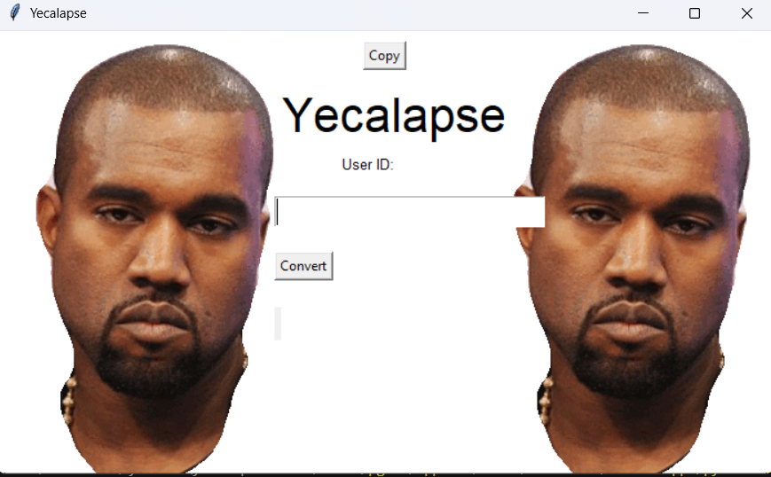

this is a HORRIBLE discord token converter.
i tried to run it as a raw python file but just run it in vscode 
# RUN IT IN VSCODE OR ELSE IT WONT WORK FOR SOME REASON 
this is also my first time making a python gui thingy so
let me search up how to upload an image rq

ok i figured it out

